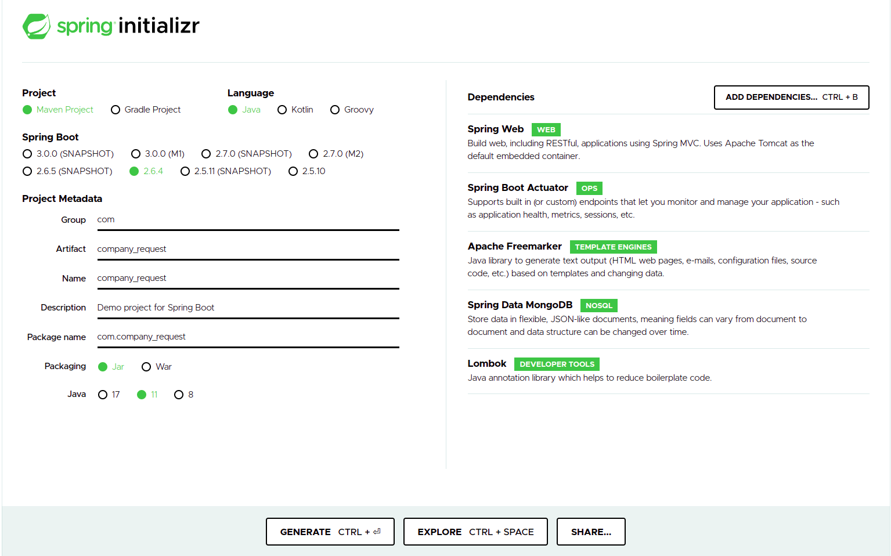

#How to build company_request

In this guide you will launch a local Kubernetes cluster, develop an app using the Spring Boot framework and deploy it
as a container in Kubernetes.

Ref:
- https://learnk8s.io/spring-boot-kubernetes-guide

## Create and run a Spring Boot Application

### Bootstrapping the app
- Go to https://start.spring.io/
  - Create a project with name `company_request`
    - Add dependencies:
      - Web -> Spring Web Starter: basic web stack support in Spring Boot
      - Actuator -> Spring Boot Actuator: provide health endpoints for our application
      - FreeMarker -> Apache FreeMarker: templating engine for HTMLs
      - MongoDB -> Spring Data MongoDB: driver and implementation for Spring Data interfaces to work with MongoDB
      - Lombok -> Lombok: library to avoid a lot of boilerplate code
    
    - Generate the project and unzip it.

### Front-end
- Create the index view in `src/main/resources/templates/`
- Add the style:
  - Copy the line of code below and paste it in the head of the html file(s) you want to include tachyons in.
    - `<link rel="stylesheet" href="https://unpkg.com/tachyons@4.12.0/css/tachyons.min.css"/>`

#### Connecting a database
The database will store the requests.

- Add the URL of the database into `src/main/resources/application.properties`
```
spring.data.mongodb.uri=mongodb://localhost:27017/dev
```

### Run the application locally
```shell
mongod
mvn clean install spring-boot:run
```
- Open `http://localhost:8080`